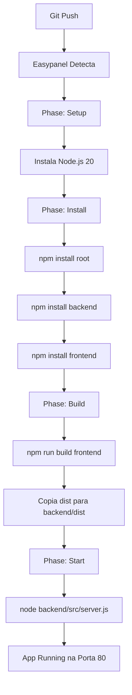

# 📦 Estrutura do Projeto - AppRomaneioEDI

## 🏗️ Arquitetura

```
AppRomaneioEDI/
├── backend/              # Servidor Node.js + Express
│   ├── src/
│   │   ├── server.js                 # Entry point
│   │   ├── config/
│   │   │   └── database.js           # Conexão SQL Server
│   │   ├── middleware/
│   │   │   ├── jwtAuth.js           # ✅ Autenticação JWT
│   │   │   ├── adminAuth.js         # Verificação de admin
│   │   │   ├── auth.js              # Auth legacy
│   │   │   ├── apiAuth.js           # API externa auth
│   │   │   └── rateLimiter.js       # Rate limiting
│   │   ├── routes/
│   │   │   ├── index.js             # Rotas principais
│   │   │   ├── database.js          # Rotas SQL Server (protegidas com JWT)
│   │   │   ├── consulta-pedidos.js
│   │   │   ├── itens-pedido.js
│   │   │   ├── pedidosol.js
│   │   │   └── validarcnpj.js
│   │   ├── services/
│   │   │   ├── authService.js               # Login AD
│   │   │   ├── romaneioService.js           # Lógica romaneio
│   │   │   ├── romaneioServiceOtimizado.js  # Versão otimizada
│   │   │   ├── ediService.js                # Lógica EDI
│   │   │   ├── ediGeneratorService.js       # Geração arquivos EDI
│   │   │   ├── pdfService.js                # Geração PDF (Puppeteer)
│   │   │   ├── emailService.js              # Envio emails (Nodemailer)
│   │   │   ├── jobQueueService.js           # ✅ Fila de jobs assíncronos
│   │   │   ├── emailTransportadoraService.js
│   │   │   └── configEdiService.js
│   │   └── utils/
│   │       └── validator.js         # Validações
│   ├── dist/                        # ✅ Frontend build (Easypanel)
│   ├── package.json
│   └── .env                         # ⚠️ NÃO COMMITAR
│
├── frontend/             # React 19 + TypeScript + Vite
│   ├── src/
│   │   ├── main.tsx                 # Entry point
│   │   ├── App.tsx                  # Router + Auth
│   │   ├── config.ts                # Configurações API
│   │   ├── global.css               # Estilos globais
│   │   ├── components/
│   │   │   ├── Login.tsx            # ✅ Login com JWT
│   │   │   ├── Home.tsx             # Dashboard principal
│   │   │   ├── GerarRomaneioEDI.tsx # Gerar romaneios
│   │   │   ├── GerenciarEmailsTransportadoras.tsx  # CRUD emails (admin)
│   │   │   ├── GerenciarConfigsEDI.tsx             # CRUD configs EDI (admin)
│   │   │   ├── ModalItensPedido.tsx # Modal detalhes
│   │   │   ├── JobNotificationContainer.tsx # ✅ Notificações jobs
│   │   │   └── Logo.tsx
│   │   ├── services/
│   │   │   ├── api.ts               # ✅ API client com JWT
│   │   │   └── apiAuth.ts
│   │   └── utils/
│   │       └── security.ts          # DevTools blocking, obfuscation
│   ├── dist/                        # Build Vite (copiado para backend/dist)
│   ├── package.json
│   ├── vite.config.ts
│   └── tsconfig.json
│
├── .env.example          # ✅ Template variáveis ambiente
├── .gitignore           # ✅ Ignora .env, node_modules
├── nixpacks.toml        # ✅ Config Easypanel build
├── package.json         # Scripts root
├── DEPLOY.md           # ✅ Guia deploy
├── CHECKLIST.md        # ✅ Checklist deploy
└── README.md           # Documentação geral
```

## 🔑 Componentes Principais

### Backend

#### 1. Autenticação JWT (`jwtAuth.js`)
```javascript
gerarToken(userData)      // Cria token JWT com 10h validade
verificarToken()          // Middleware: valida token em todas rotas protegidas
verificarTokenOpcional()  // Middleware opcional
```

#### 2. Job Queue System (`jobQueueService.js`)
```javascript
// Processamento assíncrono de emails
criarJob()               // Cria novo job
processarJob()           // Executa job
getJobStatus()           // Status do job
// Max 3 jobs simultâneos, cleanup após 1h
```

#### 3. Serviços Principais
- **authService**: Login via API AD
- **romaneioServiceOtimizado**: Queries otimizadas SQL
- **pdfService**: Gera PDFs com Puppeteer
- **emailService**: Envia emails com Nodemailer
- **ediGeneratorService**: Gera arquivos EDI

### Frontend

#### 1. API Client (`api.ts`)
```typescript
apiRequest()              // Requisição genérica com JWT
getAuthHeaders()          // ✅ Headers com Bearer token
getVisaoTransportadoras() // ✅ Usa getAuthHeaders()
// TODAS as funções usam JWT automaticamente
```

#### 2. Componentes Protegidos
- `Home.tsx`: Dashboard (requer JWT)
- `GerarRomaneioEDI.tsx`: Gerar EDI (requer JWT)
- `GerenciarEmailsTransportadoras.tsx`: CRUD emails (requer JWT + admin)
- `GerenciarConfigsEDI.tsx`: CRUD configs (requer JWT + admin)

#### 3. Sistema de Jobs
- `JobNotificationContainer`: Monitora jobs em tempo real
- Polling a cada 2 segundos
- Notificações visuais de progresso

## 🔐 Segurança Implementada

### Backend
✅ **JWT Authentication**: Todas rotas protegidas  
✅ **Rate Limiting**: 
  - Login: 5 req/15min
  - API geral: 500 req/15min  
  - Write ops: 10 req/min
✅ **SQL Injection**: Prepared statements  
✅ **CORS**: Configurado para produção  
✅ **Helmet**: Headers de segurança  
✅ **Admin Check**: Array-based ['adalbertosilva', 'albertojunio']

### Frontend
✅ **JWT Storage**: localStorage.authToken  
✅ **Auto-logout**: Token expirado → redirect /login  
✅ **DevTools Blocking**: Produção  
✅ **Console.log Removal**: Produção  
✅ **Code Obfuscation**: Terser + Vite

## 🚀 Fluxo de Deploy Nixpacks



## 📊 Banco de Dados

### SQL Server
- **Host**: 192.168.1.240
- **Database**: WMSRX_MTZ
- **Porta**: 1433
- **Encrypt**: true (TLS)

### Tabelas Principais
- Romaneios e entregas
- Transportadoras
- Pedidos e itens
- Emails transportadoras (custom)
- Configs EDI (custom)

## 🔧 Variáveis de Ambiente

Ver `.env.example` para lista completa.

### Críticas para Deploy
```env
PORT=80                    # Easypanel requer porta 80
NODE_ENV=production        # Ativa optimizações
JWT_SECRET=...            # DEVE ser seguro (64+ chars)
DB_SERVER=192.168.1.240   # IP SQL Server
```

## 📈 Monitoramento

### Logs Backend
```
✅ Servidor rodando na porta 80
🌍 Ambiente: production
📁 Servindo frontend de: /app/backend/dist
🔐 CORS configurado
💾 SQL Server habilitado
```

### Health Check
```
GET /health
Response: { "status": "ok" }
```

## 🔄 Ciclo de Vida

1. **Login**: User → AD API → JWT Token gerado
2. **Request**: Frontend envia `Authorization: Bearer TOKEN`
3. **Validation**: Backend valida token com `verificarToken()`
4. **Response**: Dados retornados ou 401 Unauthorized
5. **Expiration**: Após 10h, token expira → Auto logout

## 👥 Usuários Admin

Hardcoded em:
- `backend/src/middleware/adminAuth.js`
- `frontend/src/App.tsx`
- `frontend/src/components/Home.tsx`

```javascript
const ADMIN_USERS = ['adalbertosilva', 'albertojunio'];
```

## 📝 Próximas Melhorias

- [ ] Testes unitários (Jest)
- [ ] Testes E2E (Cypress)
- [ ] CI/CD pipeline
- [ ] Documentação API (Swagger)
- [ ] Logging estruturado (Winston)
- [ ] Monitoring (Sentry/New Relic)
- [ ] Backup automatizado
- [ ] Admin management via UI

## 📚 Documentação Adicional

- `DEPLOY.md`: Guia completo de deploy
- `CHECKLIST.md`: Checklist passo-a-passo
- `.env.example`: Template de variáveis
